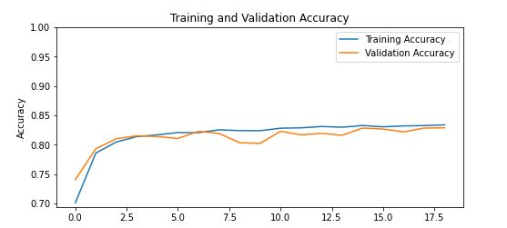

# Movie Sentiment Analysis using LSTM
Build the model locally and exposed it as a REST API using Tensorflow Serving and Kubernetes on the Google Cloud Platform. The REST API was then integrated into the flask app to get the model prediction on the web. The flask app was hosted on the compute engine VM instance on GCP.
## Model Performance
. Accuracy: 0.83

. Specificity/True Negative Rate: 0.86

. Sensitivity/True Positive Rate: 0.80

## Learning Curve
### Training and Validation Accuracy

### Training and validation loss

## Model Prediction in a Flask App
### Review

### Prediction

